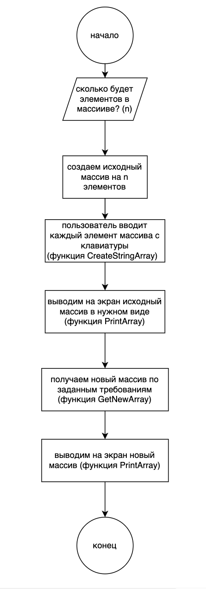
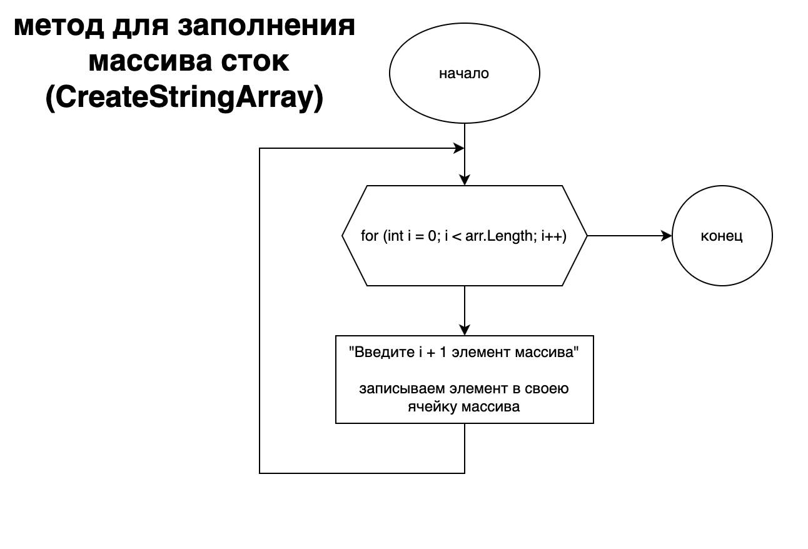
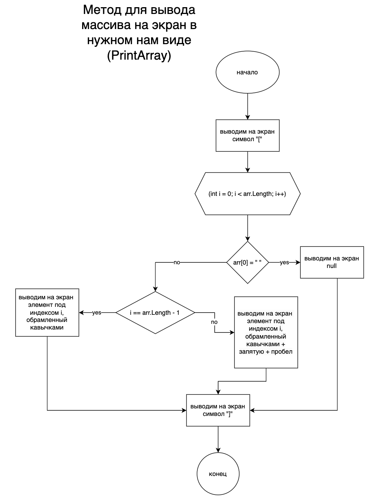
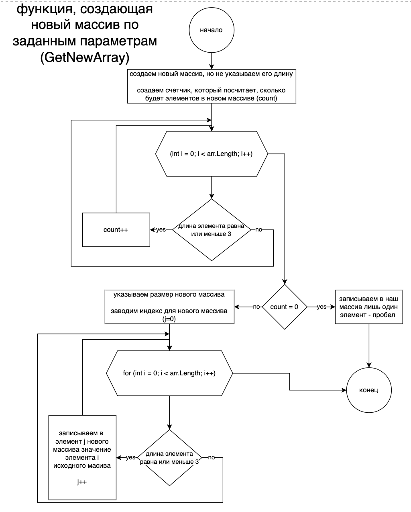

# finalControlWork
### Задача: 
Написать программу, которая из имеющегося массива строк формирует новый массив из строк, длина которых меньше, либо равна 3 символам. Первоначальный массив можно ввести с клавиатуры, либо задать на старте выполнения алгоритма. При решении не рекомендуется пользоваться коллекциями, лучше обойтись исключительно массивами.

Примеры:

[“Hello”, “2”, “world”, “:-)”] → [“2”, “:-)”]

[“1234”, “1567”, “-2”, “computer science”] → [“-2”]

[“Russia”, “Denmark”, “Kazan”] → []

# РЕШЕНИЕ
1. Я начала рисовать блок-схему и параллельно писать код.

*На буткемпе очень ругались из-за вставленных псевдо-кодов в блок-схемы, поэтому я старалась избегать в схемах написнаие кода.*

Вот такая общая схема получилась. 

2. Написала функцию для создания изначального массива, который пользователь введет с консоли (CreateStringArray). *было внесено несколько поправок и закоммичено. Предоставлена финальная схема.*

3. Написала функцию, которая будет выводить массив на экран.

*Я заранее раситала в ней все так, чтобы и конечный массив тоже выводился красиво (как написано в примерах).*

4. Написала функцию, где будет создаваться новый массив по заданным требованиеям.

5. Все это не забываю коммитить в GitHub
6. Добавила файл .gitignore
7. Соединила все функции в программе и добавила для красоты знак "->" между двумя выводящимися функциями, чтобы консоль выглядела идентично примеру в задаче.